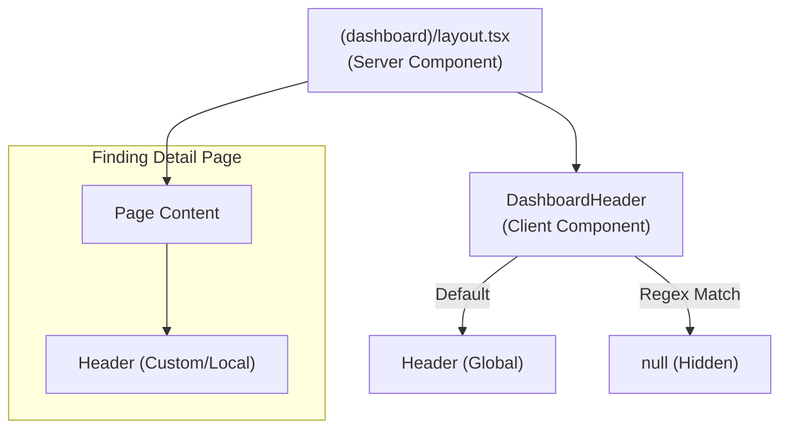

# Architecture Overview

**Project Type:** Frontend Application with Separate Backend
**Last Updated:** 2025-12-11
**Version:** 3.0.0

---

## 🏗️ System Architecture

### Architecture Type: **Frontend + Separate Backend API**

```
┌─────────────────────────────────────────────────────────┐
│                    Next.js Frontend                      │
│  ┌─────────────────────────────────────────────────┐   │
│  │           Browser (Client-side)                  │   │
│  │  - React Components                              │   │
│  │  - Zustand State Management                      │   │
│  │  - Client-side Navigation                        │   │
│  └─────────────────┬───────────────────────────────┘   │
│                    │                                     │
│  ┌─────────────────▼───────────────────────────────┐   │
│  │        Next.js Server (Edge/Node.js)            │   │
│  │  - Server Components                             │   │
│  │  - Server Actions                                │   │
│  │  - Middleware (Auth, Locale)                     │   │
│  │  - API Route Handlers (optional)                 │   │
│  └─────────────────┬───────────────────────────────┘   │
└────────────────────┼─────────────────────────────────────┘
                     │
                     │ HTTP/HTTPS Requests
                     │ (Bearer Token Auth)
                     │
┌────────────────────▼─────────────────────────────────────┐
│              External Backend API                         │
│  - RESTful APIs                                          │
│  - Business Logic                                         │
│  - Database Access                                        │
│  - File Storage                                           │
│  - Email Service                                          │
│  └──────────────────────────────────────────────────────┘
```

---

## 🎯 Architecture Decision

### ✅ **Separate Backend API** (Current Setup)

**Backend API URL:** Set in environment variable `BACKEND_API_URL` (server-side only). Client-side requests go through the Next.js proxy at `/api/v1/*`.

**Responsibilities:**

**Frontend (Next.js):**

- ✅ User Interface & UX
- ✅ Authentication Flow (Keycloak OAuth)
- ✅ Token Management (access token in memory)
- ✅ Client-side State Management (Zustand)
- ✅ Route Protection
- ✅ Form Validation (Zod)
- ✅ API Request/Response Handling
- ✅ Error Display & User Feedback

**Backend API (Separate Service):**

- ✅ Business Logic
- ✅ Database Operations (CRUD)
- ✅ Data Validation & Processing
- ✅ File Upload & Storage
- ✅ Email Sending
- ✅ Background Jobs
- ✅ Third-party API Integration
- ✅ Server-side Token Validation

---

## 📡 API Integration Pattern

### Current Setup

**Environment Variable:**

```env
# .env.local — server-side only (single source of truth)
# Client-side requests proxied through Next.js at /api/v1/*
BACKEND_API_URL=http://api:8080
```

**API Client Location:**

```
src/lib/api/
├── client.ts          # API client with auth
├── endpoints.ts       # API endpoint definitions
├── error-handler.ts   # Error handling
└── types.ts          # Request/Response types
```

### API Call Flow

```typescript
┌──────────────┐
│   Component  │
└──────┬───────┘
       │
       │ Call hook/action
       │
┌──────▼───────┐
│  Custom Hook │  (useUsers, usePosts)
│  or Action   │
└──────┬───────┘
       │
       │ Use API client
       │
┌──────▼───────┐
│  API Client  │  (fetch with auth headers)
└──────┬───────┘
       │
       │ HTTP Request
       │ Authorization: Bearer {accessToken}
       │
┌──────▼────────────┐
│   Backend API     │
│  (Your Service)   │
└───────────────────┘
```

### Example Implementation

```typescript
// src/lib/api/client.ts
import { useAuthStore } from '@/stores/auth-store'

export async function apiClient<T>(endpoint: string, options?: RequestInit): Promise<T> {
  const accessToken = useAuthStore.getState().accessToken
  // Client-side: empty string (proxied via /api/v1/*)
  // Server-side: env.api.url (BACKEND_API_URL)
  const baseUrl = getApiBaseUrl()

  const response = await fetch(`${baseUrl}${endpoint}`, {
    ...options,
    headers: {
      'Content-Type': 'application/json',
      ...(accessToken && { Authorization: `Bearer ${accessToken}` }),
      ...options?.headers,
    },
  })

  if (!response.ok) {
    throw new Error(`API Error: ${response.statusText}`)
  }

  return response.json()
}

// Usage in component
const users = await apiClient<User[]>('/api/users')
```

---

## 🔐 Authentication Flow (with Separate Backend)

```
1. User clicks Login
   └─> Frontend redirects to Keycloak

2. Keycloak authenticates user
   └─> Returns to /auth/callback with code

3. Frontend exchanges code for tokens
   └─> Stores access_token in memory (Zustand)
   └─> Stores refresh_token in HttpOnly cookie

4. Frontend makes API calls to Backend
   └─> Includes: Authorization: Bearer {access_token}

5. Backend validates token
   └─> Checks JWT signature
   └─> Checks expiration
   └─> Extracts user info from token
   └─> Returns data

6. On token expiry
   └─> Frontend refreshes token via Keycloak
   └─> Updates access_token in Zustand
   └─> Retries failed request
```

---

## 🗂️ Data Flow Patterns

### Pattern 1: Server Component + API (Recommended)

```typescript
// app/users/page.tsx (Server Component)
async function UsersPage() {
  // Fetch on server
  const users = await fetch(`${env.api.url}/api/users`, {
    headers: {
      Authorization: `Bearer ${getServerSideToken()}`,
    },
  })

  return <UserList users={users} />
}
```

**Pros:**

- SEO friendly
- Faster initial load
- No loading state needed

### Pattern 2: Client Component + SWR/React Query

```typescript
// components/users-list.tsx (Client Component)
'use client'
import useSWR from 'swr'

function UsersList() {
  const { data, error } = useSWR('/api/users', apiClient)

  if (error) return <Error />
  if (!data) return <Loading />

  return <div>{data.map(user => ...)}</div>
}
```

**Pros:**

- Client-side caching
- Auto-revalidation
- Optimistic updates

### Pattern 3: Server Action + Mutation

```typescript
// actions/create-user.ts
'use server'
export async function createUser(formData: FormData) {
  const response = await fetch(`${env.api.url}/api/users`, {
    method: 'POST',
    headers: {
      Authorization: `Bearer ${getServerSideToken()}`,
    },
    body: JSON.stringify(formData),
  })

  revalidatePath('/users')
  return response.json()
}
```

**Pros:**

- Type-safe
- Progressive enhancement
- No client-side JS needed

---

## 📦 Recommended Libraries for API Integration

### Data Fetching

```json
{
  "dependencies": {
    "swr": "^2.x", // Client-side data fetching
    "@tanstack/react-query": "^5.x" // Alternative to SWR
  }
}
```

### HTTP Client

```typescript
// Option 1: Native fetch (current)
✅ Built-in, no dependencies
❌ More boilerplate

// Option 2: Axios
✅ More features (interceptors, cancellation)
❌ Additional dependency

// Option 3: ky
✅ Modern, lightweight
❌ Less popular
```

---

## 🔧 Configuration

### Environment Variables

```env
# Backend API — single source of truth (server-side only)
# Client-side requests are proxied through Next.js at /api/v1/*
BACKEND_API_URL=http://api:8080
```

---

## 🎨 Frontend Responsibilities (This Codebase)

### ✅ What Frontend SHOULD Do

1. **UI/UX Layer**
   - Render components
   - Handle user interactions
   - Display data from backend
   - Show loading/error states

2. **Authentication**
   - OAuth flow with Keycloak
   - Token storage (memory + HttpOnly cookie)
   - Token refresh
   - Route protection

3. **Client State**
   - UI state (modals, forms)
   - Auth state (Zustand)
   - Cached API data (SWR/React Query)

4. **Validation**
   - Form validation (Zod)
   - Client-side validation for UX
   - Display validation errors

5. **API Communication**
   - HTTP requests to backend
   - Add auth headers
   - Handle responses/errors
   - Retry logic

### ❌ What Frontend SHOULD NOT Do

1. ❌ Database operations
2. ❌ Business logic (complex calculations)
3. ❌ File storage
4. ❌ Email sending
5. ❌ Background jobs
6. ❌ Third-party API calls (should go through backend)

---

## 🏛️ Backend Responsibilities (Your Separate API)

### What Backend SHOULD Provide

1. **RESTful API Endpoints**

   ```
   GET    /api/users
   POST   /api/users
   GET    /api/users/:id
   PUT    /api/users/:id
   DELETE /api/users/:id
   ```

2. **Authentication Validation**
   - Validate JWT tokens
   - Check token expiration
   - Extract user info from token

3. **Business Logic**
   - Data processing
   - Complex calculations
   - Workflow management

4. **Data Persistence**
   - Database CRUD
   - Transactions
   - Data integrity

5. **External Services**
   - Email sending
   - SMS notifications
   - Payment processing
   - File storage (S3, etc.)

---

## 📋 Integration Checklist

### Setup Required

- [ ] **Backend API URL configured** in `.env.local`
- [ ] **API client created** in `src/lib/api/client.ts`
- [ ] **Error handling** for API calls
- [ ] **Token injection** in API requests
- [ ] **API endpoints defined** in `src/lib/api/endpoints.ts`
- [ ] **Request/Response types** defined
- [ ] **Loading states** implemented
- [ ] **Error states** implemented
- [ ] **Retry logic** for failed requests
- [ ] **CORS configured** on backend (if needed)

### Backend Requirements

Your backend API should support:

- [ ] **JWT token validation** (verify Keycloak tokens)
- [ ] **CORS headers** (allow Next.js domain)
- [ ] **RESTful endpoints** (or GraphQL)
- [ ] **Error responses** (consistent format)
- [ ] **Rate limiting** (to prevent abuse)
- [ ] **API documentation** (Swagger/OpenAPI)

---

## 🔄 Migration from Mock Data

### Steps to Connect Real Backend

```bash
# 1. Install SWR or React Query
npm install swr

# 2. Create API client
# src/lib/api/client.ts

# 3. Define endpoints
# src/lib/api/endpoints.ts

# 4. Create custom hooks
# src/hooks/use-users.ts
# src/hooks/use-posts.ts

# 5. Replace mock data in components
# Before: const data = MOCK_DATA
# After:  const { data } = useSWR('/api/users')

# 6. Test API integration
npm run dev
```

---

## 🎯 Advantages of This Architecture

### ✅ Pros

1. **Separation of Concerns**
   - Frontend focuses on UI/UX
   - Backend focuses on business logic

2. **Scalability**
   - Scale frontend and backend independently
   - Multiple frontends can use same backend

3. **Technology Freedom**
   - Backend can be in any language (Node.js, Python, Go, Java)
   - Frontend stays in Next.js/React

4. **Team Structure**
   - Frontend team works independently
   - Backend team works independently

5. **Security**
   - Backend API can be private (not public)
   - Sensitive operations on backend only

### ⚠️ Considerations

1. **Network Latency**
   - Extra network hop (Frontend -> Backend -> Database)
   - Mitigation: Caching (SWR, React Query)

2. **CORS Configuration**
   - Need to configure CORS on backend
   - Development vs Production URLs

3. **Token Management**
   - Frontend must handle token refresh
   - Backend must validate tokens

4. **Error Handling**
   - Need consistent error format
   - Handle network errors gracefully

---

## 📊 Updated Production Readiness

With separate backend API:

| Category                 | Score  | Status                |
| ------------------------ | ------ | --------------------- |
| Security                 | 95/100 | ✅ Excellent          |
| Architecture             | 90/100 | ✅ Excellent          |
| Testing                  | 85/100 | ✅ Good               |
| **Database**             | N/A    | ✅ Backend handles it |
| **API/Backend**          | N/A    | ✅ Separate service   |
| **Frontend Integration** | 70/100 | ⚠️ Needs API client   |
| CI/CD                    | 20/100 | ❌ Missing            |
| Monitoring               | 10/100 | ❌ Missing            |

**Updated Score: 82/100 (B+ Grade)**

**Status:** Much closer to production-ready! Just need:

1. API client implementation (1-2 days)
2. CI/CD setup (1 day)
3. Monitoring (1 day)

---

## 🚀 Next Steps

### Immediate (This Week)

1. **Create API Client** (Priority: HIGH)
   - Setup `src/lib/api/client.ts`
   - Add auth header injection
   - Error handling

2. **Install SWR or React Query**
   - For data fetching & caching
   - Better UX with loading states

3. **Define API Endpoints**
   - Type-safe endpoint definitions
   - Request/Response types

### Short-term (Next 2 Weeks)

1. **Replace Mock Data**
   - Connect to real backend
   - Test all API calls

2. **Setup CI/CD**
   - GitHub Actions
   - Automated deployment

3. **Add Monitoring**
   - Sentry for errors
   - Analytics

---

**Architecture Type:** ✅ Frontend (Next.js) + Separate Backend API

**Readiness:** 82/100 (B+ Grade) - Almost production-ready!

**Timeline to production:** 1 week (just API integration + CI/CD)

---

---

## 🧩 Dashboard UI Architecture (New 2026)

### **Header Centralization Strategy**

To optimize performance and maintainability, the Dashboard Header architecture follows a **Hybrid Server/Client Split**:



#### **1. Layout Layer (Server Component)**

- File: `src/app/(dashboard)/layout.tsx`
- **Role**: Acts as the skeleton shell. Handles SEO metadata, cookies (Sidebar state), and wraps content in Providers.
- **Why**: Must remain a Server Component to access `cookies()` and avoid de-optimizing the entire tree.

#### **2. Header Layer (Client Component)**

- File: `src/components/layout/dashboard-header.tsx`
- **Role**: Determines _visibility_ logic based on the current route.
- **Logic**:
  - **Default**: Renders the global `<Header />`.
  - **Exceptions**: Hides global header if route matches specific patterns (e.g. specialized detail pages).
  - **Implementation**: Uses `usePathname()` hook and Regex testing.
    ```typescript
    // Example: Hide global header only on Finding Detail pages
    const shouldHideHeader = /^\/findings\/[^/]+$/.test(pathname)
    ```

#### **3. Page Layer (Server/Client Hybrid)**

- **Standard Pages**: Do _not_ render their own header. They rely on the Global Header from the Layout.
- **Exception Pages** (e.g., `findings/[id]`):
  - The Global Header is hidden via the Regex logic above.
  - The Page renders its _own_ custom `<Header>` with specific context (e.g., Back button, Breadcrumbs, Status actions).

### **Advantages**

1.  **Duplicate Removal**: Removed redundant `<Header fixed />` from 80+ pages.
2.  **Performance**: `layout.tsx` stays Server-Side. Only the Header island is Client-Side.
3.  **Flexibility**: Strict Regex allows precise exceptions (e.g., hiding header on `findings/123` but showing it on `findings/123/edit`).

---

**Last Updated:** 2026-01-25
**Version:** 3.1.0 (UI Architecture Update)
